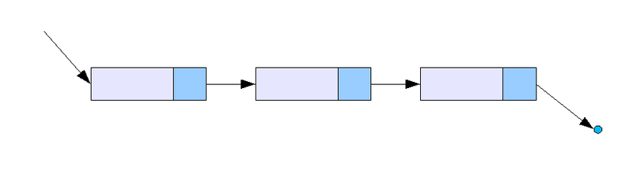
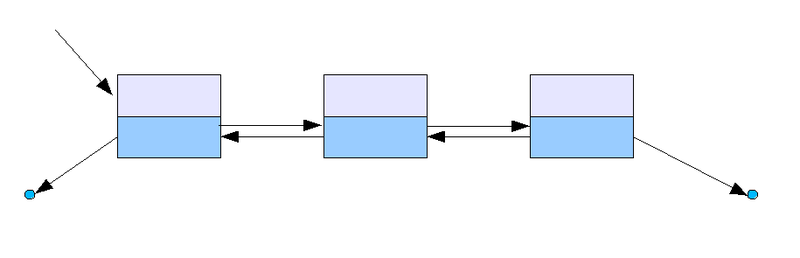
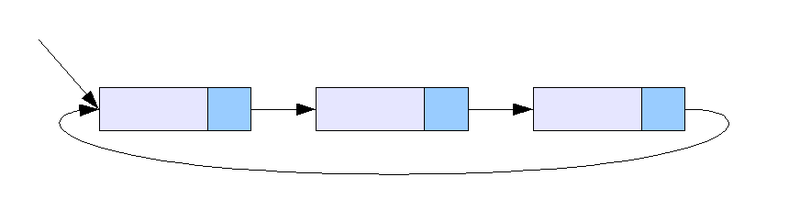

## List
List는 데이터 목록을 다루는 자료구조이다.

프로그래밍을 처음 시작할 때 가장 먼저 배우게 되는 자료구조이며, 많은 자료구조의 기초가 되는 기본적인 자료구조입니다.
특징으로는 선형구조 입니다.

선형구조란? 자료를 구성하는 원소들은 순차적으로 나열시킨 형태를 의미

비 선형 구조란? 선형 구조가 아닌 것! ㅎㅎ .... 원소들을 순차적으로 나열시키지 않은 형태입니다. 예로는 트리, 그래프가 있습니다.

이번 시간에는 연결리스트에 대해서 알아보겠습니다.

연결리스트는 각 노드가 데이터와 포인터를 가지고 한 줄로 연결되어 있는 방식으로 데이터를 저장하는 자료구조 입니다.

체인 하나를 노드로 생각을 하게된다면 체인 하나에 데이터가 있다고 가정을 하고 다음 원소를 잡아 연결되어있다고 보면 매우 유사한 형태로 이해할 수 있습니다.

이러한 연결리스트의 종류로는 단순 연결 리스트, 이중 연결 리스트, 원형 연결 리스트 이렇게 3가지가 있습니다.

개념만 이해했다면 약간의 구조만 변형을 준 것이기 때문에 어렵지 않게 이해할 수 있을 것이라 생각합니다.

그렇다면 그림을 보고 한번 이해해 보도록 하겠습니다.


## 단순 연결 리스트

[출처 : https://ko.wikipedia.org/wiki/연결_리스트]
앞에서 이야기 했던 연결리스트가 단순 연결 리스트 입니다.

노드가 단 방향으로 연결되어있는 자료구조입니다.

각 노드에는 [데이터, 포인터] 구조로 되어있고, 데이터는 각 배열의 데이터 이고, 포인터는 다음노드를 가르키는 주소이다.

이 연결 리스트의 첫번째 노드를 Head라고 하며, 맨 마지막 노드를 Tail이라고 합니다.

이 자료구조의 특징은 탐색을 하게되면 단방향 탐색만 할 수 있습니다.

이렇게 말로만 해도 이해를 하실 분이 계시고, 아닌 분들이 계실 수 있기 때문에 조금 더 쉽게 설명을 하겠습니다.

예)
\[1](Head)-\[3]-\[5]-\[7]-\[9](Tail) 

이렇게 구성된 연결리스트가 있고, 이 리스트에서 5을 검색하고 싶다면 Head부터 시작해서
 
1 == 5 ? false -> 다음 노드로 이동 -> 3 == 5 ? false -> 다음 노드로 이동 -> 5==5 ? true

이렇게 탐색을 할 것입니다. 

하지만 원소가 뒤에 치우쳐있는 9를 탐색하고 싶다면 1,3,5,7,9 모두 다 검색을 하게될 것입니다.

Tail 부터 검색을 할 수 있다면 9를 1번에 찾을 수 있지 않을 까요?
 
마치 단방향 리스트에서 1을 검색하는 것처럼!

Tail 부터 거꾸로 탐색도 가능합니다.

## 이중 연결 리스트

[출처 : https://ko.wikipedia.org/wiki/연결_리스트]
이중 연결 리스트는 단순 연결리스트를 이해했다면 무리없이 이해할 수 있는 자료구조이다.

노드가 양 방향으로 연결되어있는 자료구조입니다.

각 노드에는 [데이터, 포인터1,포인터2] 구조로 되어있고, 데이터는 각 배열의 데이터 이고, 포인터1은 이전노드를 가르키는 주소이다.

포인터2는 다음노드를 가르키는 주소이다.

이 연결 리스트의 첫번째 노드를 Head라고 하며, 맨 마지막 노드를 Tail이라고 합니다.

양 방향으로 노드의 주소를 가지고 있기 때문에 양방향 탐색을 할 수 있습니다.

이렇게 말로만 해도 이해를 하실 분이 계시고, 아닌 분들이 계실 수 있기 때문에 조금 더 쉽게 설명을 하겠습니다.

예)
\[1](Head)-\[3]-\[5]-\[7]-\[9](Tail) 

이렇게 구성된 연결리스트가 있고, 이 리스트에서 7를 검색하고 싶다면

이중연결리스트는 Tail부터도 탐색이 가능합니다. (물론 Head부터도 탐색이 가능합니다.)

9 == 7 ? false -> 다음 노드로 이동 -> 7 == 7 ? true

이렇게 탐색을 할 것입니다. 

## 원형 연결 리스트

[출처 : https://ko.wikipedia.org/wiki/연결_리스트]
원형 연결 리스트도 역시 단순 연결 리스트를 이해했다면 무리없이 이해할 수 있는 자료구조이다.

단순 연결 리스트에서 첫 번째 노드를 Head라고 하며, 맨 마지막 노드를 Tail이라고 한다고 말씀 드렸습니다.

이 자료구조는 Head와 Tail을 연결한 것이라고 그림을 봐도 어느정도 짐작할 수 있습니다.

Tail의 다음 노드를 Head를 가르 키도록 Head의 주소를 저장하게 됩니다.

이렇게 되면 원형 연결리스트에서는 Tail의 개념이 사라지게 됩니다.

나머지 부분은 단순 연결리스트와 같다고 생각하면 됩니다.


추가적으로는 현재는 원형 연결리스트에서 Tail을 Head로 연결 시켰습니다.

여기서 이중 연결 리스트로도 Tail을 Head로 연결 시킨다면 원형 이중 연결 리스트가 됩니다.


코드를 통해서 예를 들어보겠다.

단순 연결 리스트를 JAVA로 구현하였다.

이 코드에서 제네릭을 사용하였는데(<E>) 외부에서 내부 타입을 지정해주는 것이다.

한번 개념을 한번 찾아보면 조금 더 이해하기 쉬울 것이다.

추가적인 공부가 필요하면 이중 연결 리스트, 원형 연결 리스트를 구현해 보면 좋습니다.

### 단순연결리스트 구현
```java
public class LinkedListTest {
	public static void main(String[] args) {
		LinkedList<Integer> list = new LinkedList<Integer>();
		list.add(1);
		list.add(2);
		list.add(4);
		list.add(5);
		System.out.println(list.toString());
		System.out.println("Add(2,3)");
		list.add(2, 3);
		System.out.println(list.toString());
		System.out.println("Get(2) : " + list.get(2));
		list.remove(2);
		System.out.println("remove(2)");
		System.out.println(list.toString());
	}
}

class LinkedList<E> {
	Node head;
	public void add(E element) {
		Node newNode = new Node(element);
		if (head == null) {
			head = newNode;
		} else {
			Node temp = head;
			while (temp.next != null) {
				temp = temp.next;
			}
			temp.next = newNode;
		}
	}

	public void add(int index, E element) {
		Node newNode = new Node(element);
		if (index == 0) {
			newNode.next = head;
			head = newNode;
		} else {
			Node temp = head;
			while ((--index) > 0) {
				temp = temp.next;
			}
			newNode.next = temp.next;
			temp.next = newNode;
		}
	}

	public void remove(int index) {
		if (index == 0) {
			head = head.next;
		} else {
			Node temp = head;
			while ((--index) > 0) {
				temp = temp.next;
			}

			if (temp.next.next == null) {
				temp.next = null;
			} else {
				temp.next = temp.next.next;
			}
		}
	}

	public Node get(int index) {
		Node temp = head;
		while ((--index) >= 0) {
			temp = temp.next;
		}
		return temp;
	}

	@Override
	public String toString() {
		StringBuffer bf = new StringBuffer("");
		bf.append("LinkedList | ");

		Node temp = head;
		while (temp != null) {
			bf.append(temp.data.toString());
			bf.append(" ");
			temp = temp.next;
		}

		return bf.toString();
	}

	class Node<E> {
		Node next = null;
		E data;

		public Node(E data) {
			this.data = data;
		}

		@Override
		public String toString() {
			return "Node | " + data.toString();
		}
	}
}
```