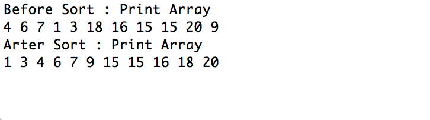
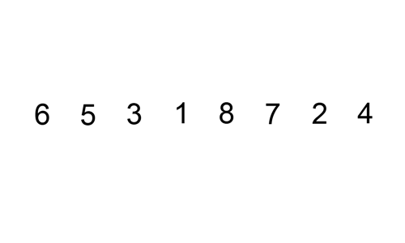
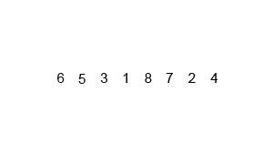

# Sort

원소들을 번호순이나 사전 순서와 같이 일정한 순서대로 열거하는 알고리즘이다.

## 1) 버블정렬

두 인접한 원소를 검사하여 정렬하는 방법이다.

코드는 짧고 간결하지만, 거의 대부분의 경우에 최악의 상황을 보여준다.

그림으로 한번 알아보자


[출처 : https://commons.wikimedia.org/]

평균, 최악 모두 수행시간은 : (n-1) + (n-2) + (n-3) ..... + 3 + 2 + 1 => n(n-1)/2 => O(n^2) 이다.

SWAP 이 많이 일어날 가능성이 많은 정렬방법이다.

코드를 통해 조금 더 알아보겠다.

### 구현 
```java
public class BubbleSortTest {

    public static void main(String[] args) {
        int inputArray[] = {4, 6, 7, 1, 3, 18, 16, 15, 15, 20, 9};
        System.out.println("Before Sort : PrintArray()");
        printArray(inputArray);
        bubbleSort(inputArray);
        System.out.println("Arter Sort : PrintArray()");
        printArray(inputArray);
    }

    public static final void bubbleSort(int input[]) {
        for (int i = 0; i < input.length - 1; i++) {
            for (int j = 0; j < input.length - i - 1; j++) {
                if (input[j] > input[j + 1]) {
                    swap(input, j, j + 1);
                }
            }
        }
    }

    public static void swap(int[] array, int index1, int index2)

    {
        int temp = array[index1];
        array[index1] = array[index2];
        array[index2] = temp;
    }

    public static final void printArray(int array[]) {
        for (int element : array) {
            System.out.print(element + " ");
        }
        System.out.println("");
    }
}
```


결과 ) 



버블정렬도 개선을 하자면 코드에 boolean 값을 추가해서 swap()이 일어났는지 체크하고, 일어나지 않았다면 바로 정렬을 종료할 수 있다. 이 부분에서는 의미가 있다. 이렇게 구현한다면 정렬이 된 경우에서는 O(n)의 성능을 보여준다.


## 2) 선택정렬

선택 정렬은 제자리 정렬 알고리즘의 하나로, 다음과 같은 순서로 이루어진다.
1. 주어진 리스트 중에 최솟값을 찾는다.
2. 그 값을 맨 앞에 위치한 값과 교체한다(패스(pass)).
3. 맨 처음 위치를 뺀 나머지 리스트를 같은 방법으로 교체한다.
그림으로 한번 알아보자


[출처 : https://commons.wikimedia.org/]

평균, 최악 모두 수행시간은 : (n-1) + (n-2) + (n-3) ..... + 3 + 2 + 1 => n(n-1)/2 => O(n^2) 이다.

SWAP 이 버블정렬에 비해서 많이 일어날 가능성이 적은 정렬방법이다.

코드를 통해 조금 더 알아보겠다.

### 구현 

```java
public class SelectSortTest {

    public static void main(String[] args) {
        int inputArray[] = {4, 6, 7, 1, 3, 18, 16, 15, 15, 20, 9};
        System.out.println("Before Sort : PrintArray()");
        printArray(inputArray);
        selectSort(inputArray);
        System.out.println("Arter Sort : PrintArray()");
        printArray(inputArray);
    }

    public static final void selectSort(int array[]) {

        for (int i = 0; i < array.length - 1; i++) {
            int temp = i;
            for (int j = i + 1; j < array.length; j++) {
                if (array[temp] > array[j]) {
                    temp = j;
                }
            }
            swap(array, i, temp);
        }
    }
    public static void swap(int[] array, int index1, int index2)

    {
        int temp = array[index1];
        array[index1] = array[index2];
        array[index2] = temp;

    }

    public static final void printArray(int array[]) {
        for (int element : array) {
            System.out.print(element + " ");
        }
        System.out.println("");
    }

}
```


결과 ) 


## 3) 삽입정렬

삽입 정렬은 자료 배열의 모든 요소를 앞에서부터 차례대로 이미 정렬된 배열 부분과 비교하여, 자신의 위치를 찾아 삽입함으로써 정렬을 완성하는 알고리즘이다.
그림으로 한번 알아보자



[출처 : https://commons.wikimedia.org/]

최악 수행시간은 : 1 + 2 + 3 + ..... + (n-3) + (n-2) + (n-1) => n(n-1)/2 => O(n^2) 이다.

최단 수행시간은 : [ 1 + 1 + 1 + ...... + 1 + 1 + 1] =>  n => O (n)

최단 수행시간은 배열이 정렬이 되어있는 경우이다

최악의 수행시간은 배열이 역순으로 정렬이 되어있는 경우입니다.

코드를 통해 조금 더 알아보겠다.

### 구현
```java
public class InsertSortTest {

    public static void main(String[] args) {
        int inputArray[] = {4, 6, 7, 1, 3, 18, 16, 15, 15, 20, 9};
        System.out.println("Before Sort : PrintArray()");
        printArray(inputArray);
        insertSort(inputArray);
        System.out.println("Arter Sort : PrintArray()");
        printArray(inputArray);
    }

    public static final void insertSort(int array[]) {
        int j;
        for (int i = 1; i < array.length; i++) {
            int insert = array[i];
            for (j = i - 1; j >= 0; j--) {
                if (insert < array[j]) {
                    array[j + 1] = array[j];
                } else {
                    break;
                }
            }
            array[j + 1] = insert;
        }
    }

    public static final void printArray(int array[]) {
        for (int element : array) {
            System.out.print(element + " ");
        }
        System.out.println("");
    }
}
```
결과 ) 


* 분할 정복 알고리즘(Divide and conquer algorithm)은 그대로 해결할 수 없는 문제를 작은 문제로 분할하여 문제를 해결하는 방법이나 알고리즘이다.


## 4) 병합정렬

분할 정복 알고리즘 중의 하나이다.

합병 정렬은 다음과 같이 작동한다.
1. 리스트의 길이가 0 또는 1이면 이미 정렬된 것으로 본다. 그렇지 않은 경우에는 정렬되지 않은 리스트를 절반으로 잘라 비슷한 크기의 두 부분 리스트로 나눈다.
2. 각 부분 리스트를 재귀적으로 합병 정렬을 이용해 정렬한다.
3. 두 부분 리스트를 다시 하나의 정렬된 리스트로 합병한다.
그림으로 한번 알아보자



[출처 : https://commons.wikimedia.org/]

평균, 최악 모두 수행시간은 : O(nlogn) 이다.

코드를 통해 조금 더 알아보겠다.

### 구현
```
public class MergeSortTest {

    public static void main(String[] args) {
        int inputArray[] = {4, 6, 7, 1, 3, 18, 16, 15, 15, 20, 9};
        System.out.println("Before Sort : PrintArray()");
        printArray(inputArray);
        mergeSort(inputArray, 0, inputArray.length - 1);
        System.out.println("Arter Sort : PrintArray()");
        printArray(inputArray);
    }

    public static void mergeSort(int[] array, int low, int high) {
        if (low < high) {
            int middle = (low + high) / 2;
            mergeSort(array, low, middle);
            mergeSort(array, middle + 1, high);
            merge(array, low, middle, high);
        }
    }

    public static void merge(int[] array, int low, int middle, int high) {
        int[] helper = new int[array.length];

        for (int i = low; i <= high; i++) {
            helper[i] = array[i];
        }

        int helperLeft = low;
        int helperRight = middle + 1;
        int current = low;

        while (helperLeft <= middle && helperRight <= high) {
            if (helper[helperLeft] <= helper[helperRight]) {
                array[current] = helper[helperLeft];
                helperLeft++;

            } else {
                array[current] = helper[helperRight];
                helperRight++;

            }
            current++;

        }
        int remain = middle - helperLeft;
        for (int i = 0; i <= remain; i++) {
            array[current + i] = helper[helperLeft + i];
        }
    }

    public static final void printArray(int array[]) {
        for (int element : array) {
            System.out.print(element + " ");
        }
        System.out.println("");
    }

}
```


결과 ) 


## 5) 퀵정렬

분할 정복 알고리즘 중의 하나이다.

퀵이라는 이름에서 알 수 있듯이 평균적인 상황에서 최고의 성능을 나타낸다.

1. 리스트 가운데서 하나의 원소를 고른다. 이렇게 고른 원소를 피벗이라고 한다.
2. 피벗 앞에는 피벗보다 값이 작은 모든 원소들이 오고, 피벗 뒤에는 피벗보다 값이 큰 모든 원소들이 오도록 피벗을 기준으로 리스트를 둘로 나눈다. 이렇게 리스트를 둘로 나누는 것을 분할이라고 한다. 분할을 마친 뒤에 피벗은 더 이상 움직이지 않는다.
3. 분할된 두 개의 작은 리스트에 대해 재귀(Recursion)적으로 이 과정을 반복한다. 재귀는 리스트의 크기가 0이나 1이 될 때까지 반복된다.
재귀 호출이 한번 진행될 때마다 최소한 하나의 원소는 최종적으로 위치가 정해지므로, 이 알고리즘은 반드시 끝난다는 것을 보장할 수 있다.
그림으로 한번 알아보자


[출처 : https://commons.wikimedia.org/]

평균 수행시간은 : O(nlogn) 이다.

최악 수행시간은 : O(n^2) 이다.

최악 수행시간인 경우는 배열이 정렬이 되어있고, 피벗을 앞에서만 선택을 하는 경우이다.

또는 배열이 역순으로 정렬이 되어있고, 피벗을 뒤에서만 선택을 하는 경우이다.

퀵정렬이 병합정렬보다 최악의 경우는 더 느릴 수 있지만, 최악의 경우가 될 확률이 적다.

아래의 코드는 피벗을 앞에서만 선택을 하는 경우이다.

코드를 통해 조금 더 알아보겠다.

### 구현
```java

public class QuickSortTest {

    public static void main(String[] args) {
        int inputArray[] = {4, 6, 7, 1, 3, 18, 16, 15, 15, 20, 9};
        System.out.println("Before Sort : PrintArray()");
        printArray(inputArray);
        quickSortPivotZero(inputArray, 0, inputArray.length - 1);
        System.out.println("Arter Sort : PrintArray()");
        printArray(inputArray);
    }

    public static void quickSortPivotZero(int[] array, int left, int right) {
        if (left < right) {
            int pivot = array[left];
            int i = left;
            int j = right;

            while (i < j) {
                while (array[j] > pivot)
                    j--;
                while (i < j && array[i] <= pivot)
                    i++;
                int temp = array[i];
                array[i] = array[j];
                array[j] = temp;
            }
            array[left] = array[i];
            array[i] = pivot;

            quickSortPivotZero(array, left, i - 1);
            quickSortPivotZero(array, i + 1, right);
        }
    }

    public static final void printArray(int array[]) {
        for (int element : array) {
            System.out.print(element + " ");
        }
        System.out.println("");
    }

}
```

결과 ) 


Partition을 적용해서 구현할 수도 있다.

````java
public static void quickSortPivotZeroWithPartition(int[]array,int left,int right){
        if(left<right){
        int partition=partitionIt(array,left,right);
        quickSortPivotZerWithPartition(array,left,partition-1);
        quickSortPivotZerWithPartition(array,partition+1,right);
        }

        }
public static int partitionIt(int[]array,int left,int right){
        int pivot=array[left];
        int i=left;
        int j=right;
        while(i<j){
        while(array[j]>pivot)j--;
        while(i<j &&array[i]<=pivot)i++;
        swap(array,i,j);
        }
        swap(array,left,i);
        return i;
        }
````

최악 수행시간을 피하기 위해서는 Pivot을 정하는 방법을 정하는 것이 중요하다. 또한 Pivot을 잡는 방법이 퀵소트의 성능에 중요한 역할을 한다.

Pivot을 최대한 가운대 값으로 잡아가는 것이 좋다. medianOf3 알고리즘을 소개한다.

Pivot을 잡는 방법을 배열의 첫번째, 가운대, 끝 을 잡아서 3중 가운데 값으로 Pivot을 잡는 방법이고 나머지는 동일하다.

이 것만으로도 성능이 많이 개선 될 수 있다.


### 구현 전체

```java
public class QuickSortTest {

    public static void main(String[] args) {
        int inputArray[] = {4, 6, 7, 1, 3, 18, 16, 15, 15, 20, 9};
        System.out.println("Before Sort : PrintArray()");
        printArray(inputArray);
        quickSortPivotMedian(inputArray, 0, inputArray.length - 1);
        System.out.println("Arter Sort : PrintArray()");
        printArray(inputArray);
    }

    public static void quickSortPivotMedian(int[] array, int left, int right) {
        int size = right - left + 1;
        if (size <= 3) {
            manualSort(array, left, right, size);
        } else {
            int median = medianOf3(array, left, right);
            int partition = partitionIt(array, left, right, median);
            quickSortPivotMedian(array, left, partition - 1);
            quickSortPivotMedian(array, partition + 1, right);
        }
    }

    public static int medianOf3(int[] array, int left, int right) {
        int center = (left + right) / 2;
        if (array[left] > array[center])
            swap(array, left, center);
        if (array[left] > array[right])
            swap(array, left, right);
        if (array[center] > array[right])
            swap(array, center, right);

        swap(array, center, right - 1);
        return array[right - 1];
    }

    public static int partitionIt(int[] array, int left, int right, long pivot) {
        int leftPtr = left;
        int rightPtr = right - 1;

        while (true) {
            while (array[++leftPtr] < pivot)
                ;
            while (array[--rightPtr] > pivot)
                ;
            if (leftPtr >= rightPtr)
                break;
            else
                swap(array, leftPtr, rightPtr);
        }
        swap(array, leftPtr, right - 1);
        return leftPtr;
    }

    public static void manualSort(int[] array, int left, int right, int size) {

        if (size <= 1)
            return;
        if (size == 2) {
            if (array[left] > array[right])
                swap(array, left, right);
            return;
        } else
        {
            if (array[left] > array[right - 1])
                swap(array, left, right - 1);
            if (array[left] > array[right])
                swap(array, left, right);
            if (array[right - 1] > array[right])
                swap(array, right - 1, right);
        }
    }

    public static void swap(int[] array, int index1, int index2)

    {
        int temp = array[index1];
        array[index1] = array[index2];
        array[index2] = temp;
    }

    public static final void printArray(int array[]) {
        for (int element : array) {
            System.out.print(element + " ");
        }
        System.out.println("");
    }

}

```


결과 ) 


참고
https://ko.wikipedia.org/wiki/정렬_알고리즘