## Tree
트리는 나무랑 비슷한 자료구조라고 해서 트리라고 부릅니다.

보통 일상생활에서는 조직도와같은 곳에서 많이 익숙한 자료구조입니다. 

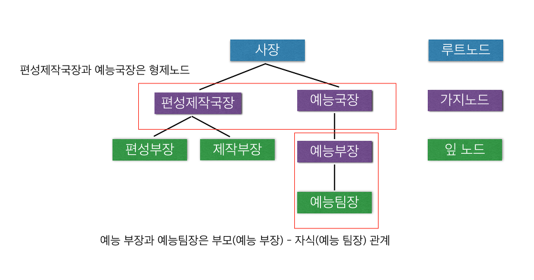

여기서 최상위 노드인 사장은 루트노드, 자식이 없는 노드인 편성부장, 제작부장, 예능 팀장 은 잎노드 라고 합니다. 나머지는 가지노드라고 생각하면 됩니다.

트리에서는 부모 - 자식 관계가 성립을 하는데요! 예능부장과 예능 팀장은 부모 자식 관계 입니다. 

또한 같은 부모를 가진 노드들을 형제노드라고 합니다. 사장이라는 부모를 가진 편성제작국장과 예능국장은 형제노드입니다.


트리는 뿌리 - 가지 - 잎이 있다고 상상하고 거꾸로 그렸다고 생각하면 왜 트리인지 용어정리가 더 잘될 것입니다. 

조금 더 단어를 정리하도록 하겠습니다.
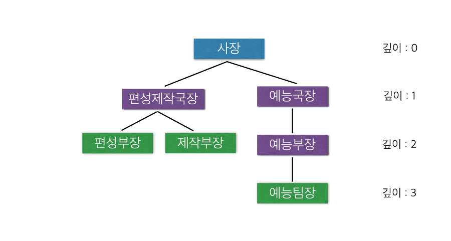


### 깊이

루트 노드에서 해당 노드까지거쳐야 하는 노드의 개수

위 그림에서 오른쪽에 표시해 두었기 때문에 쉽게 이해할 수 있다고 생각한다. 


### 레벨

깊이가 같은 노드의 집합

레벨이 2인 노드는 편성부장, 제작부장, 예능부장이 있다. 
여기서 형제노드랑은 차이점을 명확히 해야한다. 형제노드는 부모가 같아야 한다!

### 높이
루트에서부터 가장 깊은 잎 노드까지의 깊이

이 트리의 높이는 3이다.
가장 깊은 노드는 예능팀장으로 깊이가 3이기 때문이다.


### 노드의 차수
자식 노드의 개수

편성제작국장의 차수는 2이다.
편성부장, 제작부장 2개가 있다.


### 트리의 차수
자식 노드가 가장 많은 노드의 차수

이 트리의 차수는 2이다.
편성제작국장의 차수는 2이다. 가장 차수가 크다.
편성부장, 제작부장 2개가 있다.


### 1. Left Child, Right Sibling 트리

한개의 노드에 데이터, 자식 포인터, 형제 포인터를 가지고 있어서 트리를 구성하는 구조 입니다.


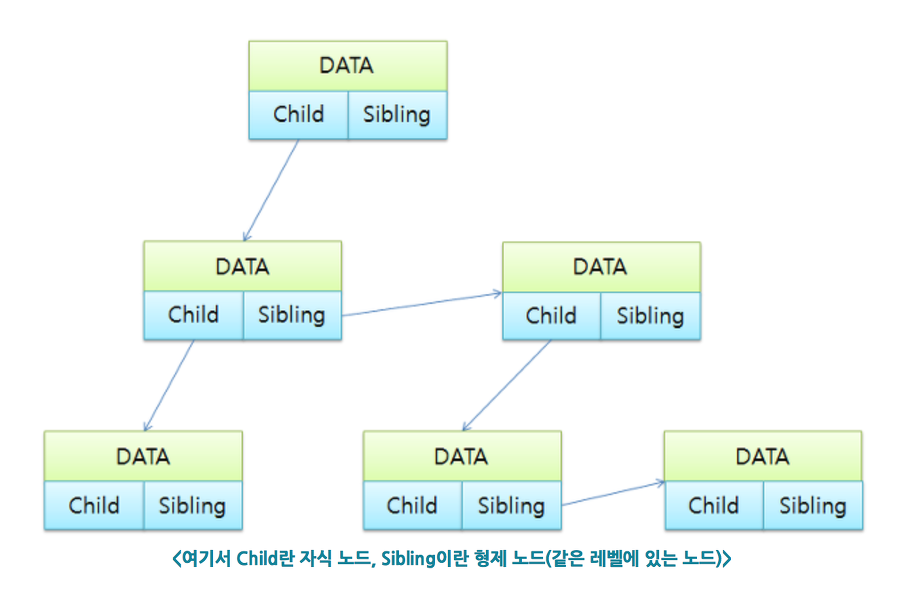
[출처 : http://blog.eairship.kr/215]

딱 봐도 어떤 구조인지 알 수 있을 것이다.

코드를 보면서 조금 더 이해해 보자.

코드 ) 
```java
public class LeftChildRightSiblingTest {

    public static void main(String[] args) {
        LeftChildRightSiblingTree tree = new LeftChildRightSiblingTree();
        Node root = new Node('A');
        Node B = new Node('B');
        Node C = new Node('C');
        Node D = new Node('D');
        Node E = new Node('E');
        Node F = new Node('F');
        Node G = new Node('G');
        Node H = new Node('H');

        tree.append(root, B);
        tree.append(B, C);
        tree.append(B, D);
        tree.append(C, E);
        tree.append(C, F);
        tree.append(C, G);
        tree.append(E, H);

        tree.printTree(root, 0);
    }

}

class LeftChildRightSiblingTree {
    public void append(Node parent, Node child) {
        if (parent.getLeftChild() == null)
            parent.setLeftChild(child);
        else {
            Node temp = parent.getLeftChild();
            while (temp.getRightSibling() != null)
                temp = temp.getRightSibling();
            temp.setRightSibling(child);
        }
    }
    // 해당 노드의 왼쪽 자식이 없다면 왼쪽에 추가하고, 자식이 있다면 그 자식과 형제노드인 오른쪽으로 추가한다.
    public void printTree(Node node, int depth) {
        for (int i = 0; i < depth; i++)
            System.out.print("-");
        System.out.println(node.getData());
        if (node.getLeftChild() != null)
            printTree(node.getLeftChild(), depth + 1);
        if (node.getRightSibling() != null)
            printTree(node.getRightSibling(), depth);
    }
}

class Node {
    private char data;
    private Node leftChild;
    private Node rightSibling;

    public Node(char data) {
        this.data = data;
    }

    public char getData() {
        return data;
    }

    public void setData(char data) {
        this.data = data;
    }

    public Node getLeftChild() {
        return leftChild;
    }

    public void setLeftChild(Node leftChild) {
        this.leftChild = leftChild;
    }

    public Node getRightSibling() {
        return rightSibling;
    }

    public void setRightSibling(Node rightSibling) {
        this.rightSibling = rightSibling;
    }
}
```

실행결과 ) 


빠르게 이해를 돕기위해 칠판에 판서를 해봤다.
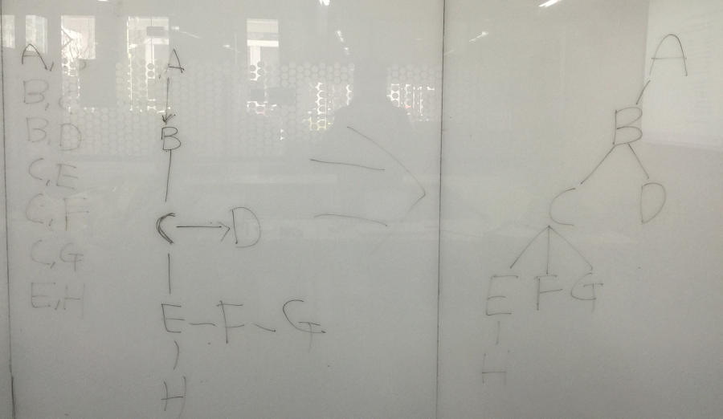


### 2. 이진 트리(Binary Tree)

한개의 노드에 데이터, 왼쪽 자식 포인터, 오른쪽 자식 포인터를 가지고 있어서 자식이 최대 2를 가지는 트리이다.

#### 1) 편향, 사향 이진 트리
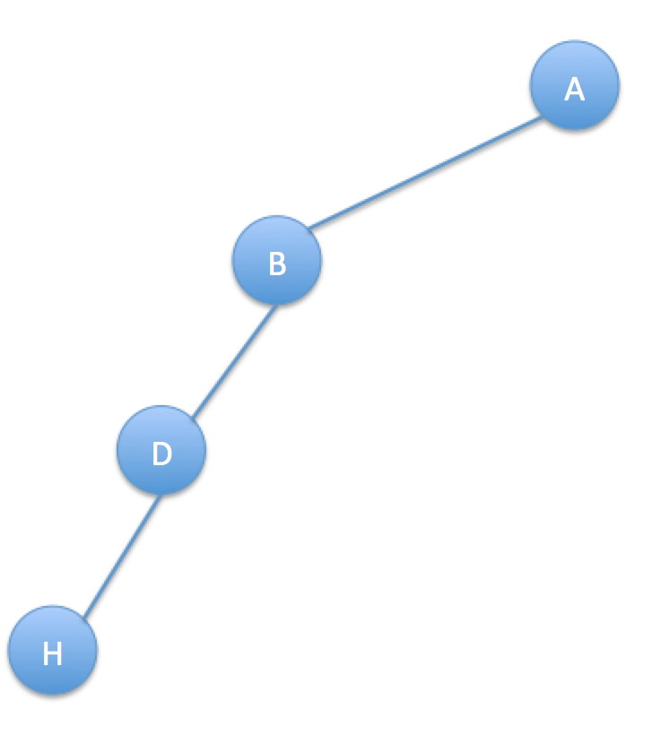
트리의 노드가 왼쪽이나 오른쪽으로 한쪽으로만 노드가 있는 트리이다. 


#### 2) 포화 이진 트리
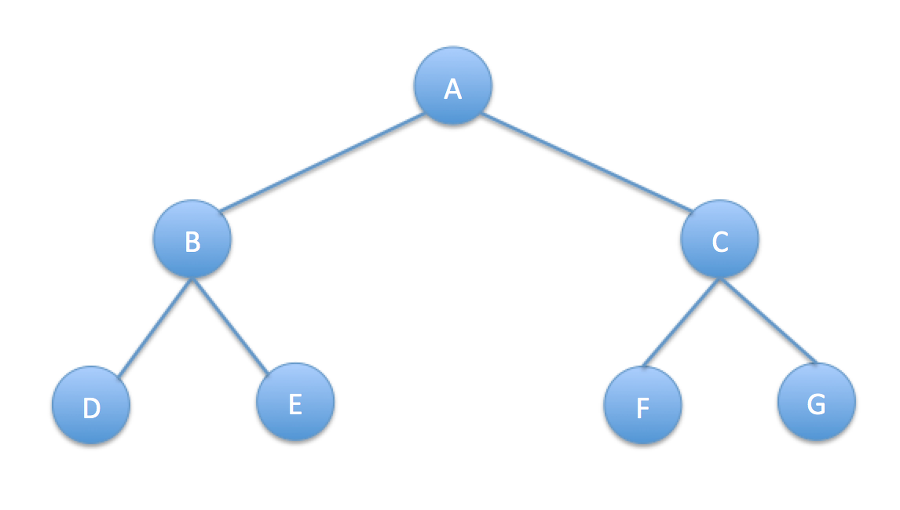

모든 레벨의 노드가 꽉 차있는 이진 트리. 잎 노드를 제외한 모든 노드의 차수가 2인 형태를 말한다.


#### 3) 완전 이진 트리


잎 노드들이 트리의 왼쪽부터 차곡차곡 채워진 트리를 말한다.

#### 트리 순회법

전위 순회(preorder)는 다음과 같은 방법으로 진행한다. 루트 노드에서 시작해서,

1. 노드를 방문한다.
2. 왼쪽 서브 트리를 전위 순회한다.
3. 오른쪽 서브 트리를 전위 순회한다.
전위 순회는 깊이 우선 순회(depth-first traversal)라고도 한다.
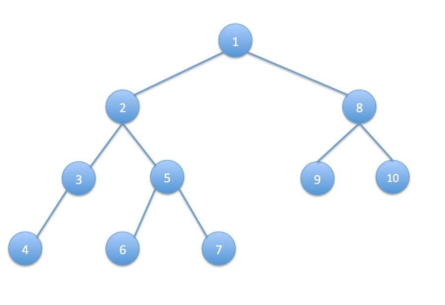


중위 순회(Inorder Traversal)은 다음의 순서로 진행된다.

1. 왼쪽 서브 트리를 중위 순회한다.
2. 노드를 방문한다.
3. 오른쪽 서브 트리를 중위 순회한다.
중위 순회는 대칭 순회(symmetric traversal)라고도 한다.
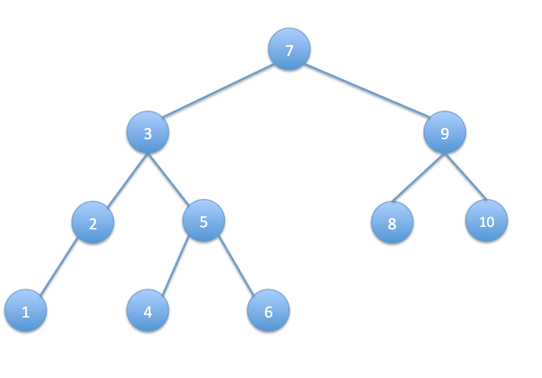


후위 순회(postorder)는 다음과 같은 방법으로 진행한다.

왼쪽 서브 트리를 후위 순회한다.
오른쪽 서브 트리를 후위 순회한다.
노드를 방문한다.
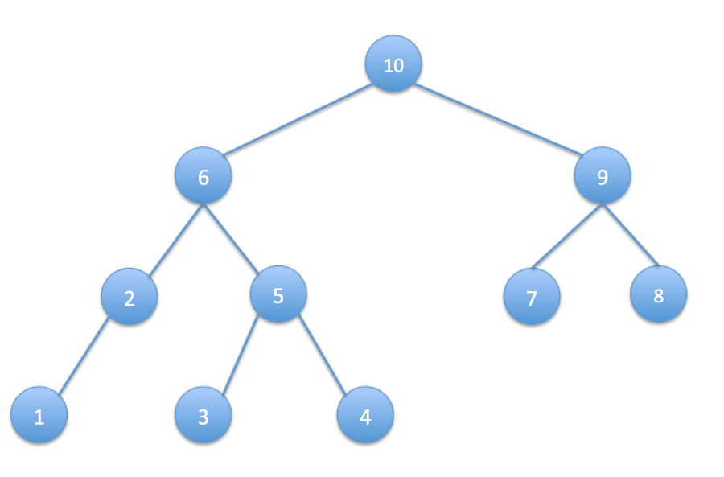


코드를 통해서 알아보자
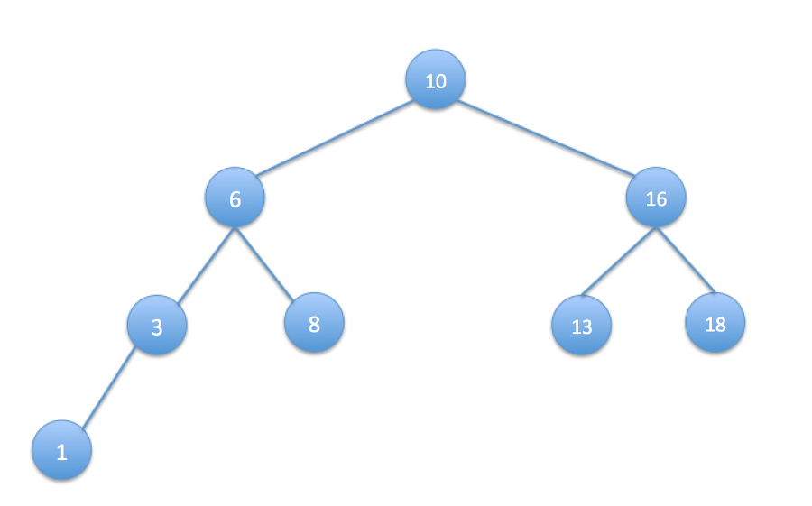

이진트리를 이렇게 구성해 놓고 순회법을 테스트 하였다.


코드 ) 
```java

public class BinaryTreeTest {

    public static void main(String[] args) {
        BinaryNode<Integer> root = new BinaryNode<Integer>(10);
        BinaryNode<Integer> six = new BinaryNode<Integer>(6);
        BinaryNode<Integer> three = new BinaryNode<Integer>(3);
        BinaryNode<Integer> eight = new BinaryNode<Integer>(8);
        BinaryNode<Integer> one = new BinaryNode<Integer>(1);
        BinaryNode<Integer> sixTeen = new BinaryNode<Integer>(16);
        BinaryNode<Integer> thirTeen = new BinaryNode<Integer>(13);
        BinaryNode<Integer> eighteen = new BinaryNode<Integer>(18);
        root.setLeft(six);
        root.setRight(sixTeen);
        six.setLeft(three);
        six.setRight(eight);
        three.setLeft(one);
        sixTeen.setLeft(thirTeen);
        sixTeen.setRight(eighteen);

        System.out.println("전위순회");
        PreOrderPrintTree(root);
        System.out.println("중위순회");
        InOrderPrintTree(root);
        System.out.println("후위순회");
        PostOrderPrintTree(root);

    }

    public static void PreOrderPrintTree(BinaryNode node)
    {
        if(node == null)
            return;
        System.out.println("" + node.getData());
        PreOrderPrintTree(node.getLeft());
        PreOrderPrintTree(node.getRight());
    }

    /* 중위 순회 */
    public static void InOrderPrintTree(BinaryNode node)
    {
        if(node == null)
            return;
        InOrderPrintTree(node.getLeft());
        System.out.println("" + node.getData());
        InOrderPrintTree(node.getRight());
    }

    /* 후위 순회 */
    public static void PostOrderPrintTree(BinaryNode node)
    {
        if(node == null)
            return;
        PostOrderPrintTree(node.getLeft());
        PostOrderPrintTree(node.getRight());
        System.out.println("" + node.getData());
    }
}

class BinaryNode<E>{
    private E data;
    private BinaryNode<E> left;
    private BinaryNode<E> right;
    public BinaryNode(E data){
        this.data = data;
    }
    public E getData() {
        return data;
    }
    public void setData(E data) {
        this.data = data;
    }
    public BinaryNode<E> getLeft() {
        return left;
    }
    public void setLeft(BinaryNode<E> left) {
        this.left = left;
    }
    public BinaryNode<E> getRight() {
        return right;
    }
    public void setRight(BinaryNode<E> right) {
        this.right = right;
    }
}
```


실행결과 ) 
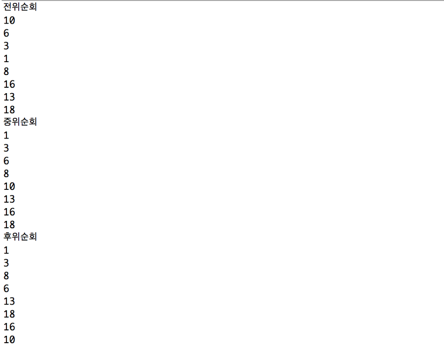