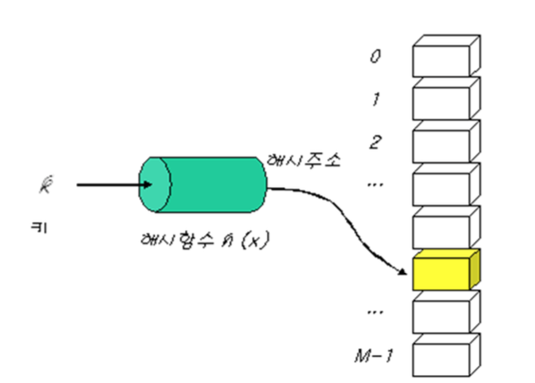
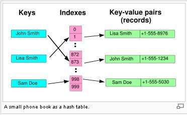
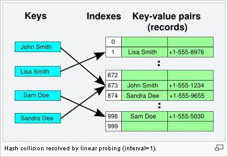

# Hash Table
해싱은 키값을 비교함으로써 탐색하고자하는 항목에 접근하는 것을 이야기 합니다.

키 값에 산술적인 연산을 적용하여 항목이 저장되어있는 테이블의 주소를 계산하여 항목에 접근하고, 

이 값의 연산에 의해서 직접 접근 할 수 있는 테이블은 해시 테이블 입니다.

또한 해시 테이블을 이용한 탐색을 해싱이라고 합니다.

HashFunction : 탐색키를 입력으로 받아서 해시 주소를 생성한다.

해싱의 기본적인 원리 입니다.

#### 1. 탐색키를 입력으로 받아서 해시 주소를 생성한다.(HashFunction 의 기능)
99999(탐색키) -> HashFunction(99999) -> 1024(해시주소)

#### 2. HashFunction에서 생성된 해시주소를 이용해서 요소에 접근합니다.
Table[1024]

21 - 12 -   - 99999 - 9733 -   -   1232 ...

메모리 낭비가 심해진다.

HashTable : 해시 주소에 매핑해서 값을 저장하는 배열

위와 같이 메모리 낭비를 줄이기 위해서 해시 테이블의 크기는 제한되어 있다.

해시 테이블의 크기가 M 개라고 한다면 0 ~ M-1 의 주소안에 적절한 해시 주소를 만드는 것이 필요할 것이다.

해시테이블은 HashTable[0], HashTable[1] ..... HashTable[M-1] 총 M개의 버킷으로 구성이 됩니다.

그래서 해시테이블의 해시주소에 저장을 하게 될 것입니다. 

[출처 : http://mclab.silla.ac.kr/lecture/201301/algorithm/lecture_09.pdf]

[출처 : http://egloos.zum.com/sweeper/v/925740]

이 부분으로 보면 조금 더 이해가 쉬울 수 있습니다.

John Smith를 해시함수를 통해 얻은 해시 주소가 873이라면 873의 인덱스를 가진 버킷을 저장하고, 찾아낼 수 있습니다.

다른 입력키를 입력하더하도 해시함수를 통해서 얻은 해시주소가 같다면 같은 버킷에 접근하는 것을 '충돌'이라고 합니다.

HashTable의 장점은 인덱스를 통해서 O(1) 의 성능을 자랑하는 것인데요, 해당 버킷에 충돌이 없을 경우에 최적의 경우에 성능입니다.

n개의 원소들이 있고, 모두다 HashFunction을 통해서 얻은 해시주소가 같다면 성능은 O(n)으로 떨어지기 때문에 해시 함수의 역할도 중요하다고 볼 수 있습니다.

좋은 해시 함수가 되기 위해서는

- 충돌이 적어야합니다. 

- 해시 함수 값이 해시테이블의 주소영역 내에서 고르게 분포되어야 합니다.

- 계산이 빨라야 합니다.

해시함수의 종류에는 나눗셈 법, 자릿수 접기, 폴딩 함수, 중간제곱함수, 비트추출함수, 숫자분석방법 등 다양한 방법이 있습니다.

또한 앞에서 말했던 같은 버킷을 사용하는 경우 충돌에 대한 해결이 필요합니다.

충돌을 해경하는 방법은 Open-Addressing, Chaining 기법이 있습니다.

### 1) Open-Addressing

[출처 : http://egloos.zum.com/sweeper/v/925740]

충돌이 일어날때 해시함수에 의해 얻어진 주소가 아니더라도 다른 주소를 사용할 수 있도록 허용

#### 1. 선형탐사 (LinearProbing)
해시함수로부터 얻은 해시함수 주소에 다른값이 입력되어 있다면 다음 주소(고정폭 : 1)에 저장한다.

버킷이 비어있을 때까지 계속 반복합니다. 다시 시작한 위치까지 돌아오게되면 해시테이블이 꽉 찻다고 알 수 있습니다.

#### 2. 제곱탐사 (Quadratic Probling)
선형탐사는 고정폭을 기준으로 이동했던 것과 다르게 제곱탐사는 이동폭이 제곱으로 늘어나는 차이이다.

#### 3. 이중해싱(Double Hashing)
2개의 해시함수를 이용해서 하나의 해시함수로 충돌이 일어났을 때 다른 하나로 이동폭을 얻는다.

이렇게 충돌을 해결해도 해시테이블의 용량이 모두 차버린다면, 테이블의 크기를 늘려야하고, 늘린 해시테이블의 크기에 맞춰서 다시 데이터를 해싱해야한다.

이 것을 재해싱(ReHashing) 이라고 한다. 

### 2) Chaining 

[출처 : http://egloos.zum.com/sweeper/v/925740]

충돌이 일어날 때 각각의 버킷에서 가리키고 있는 인덱스에 연결리스트로 연결하여 저장한다고 생각하면 됩니다.

위에서 John Smith와 Sandra Deed의 해시 주소가 충돌이 일어났을 때 873 인덱스에 연결리스트 형태로 873 - John Smith - Sandra Deed 이렇게 연결한다고 생각하면 쉽습니다.

삭제가 간단하고, 모든 버켓이 사용중이여도 계속해서 재해싱을 하지 않고 사용할 수 있다. ( 물론 성능을 위해 재해싱이 필요하지만 시기를 늦출 수 있다. )

실제로 Java의 HashMap은 자바 8 이전에는 LinkedList로 구현되어 있었습니다. 충돌일 경우 순차 탐색을 해야될 경우 최악의 시간복잡도는 O(n)이 였습니다.

하지만 자바 8 부터는 LinkedList를 Red-Black-Tree로 바꾸면서 충돌일 경우 최악의 시간복잡도를 O(logn)으로 줄일 수 있었습니다.

### 참고
http://egloos.zum.com/sweeper/v/925740

http://mclab.silla.ac.kr/lecture/201301/algorithm/lecture_09.pdf