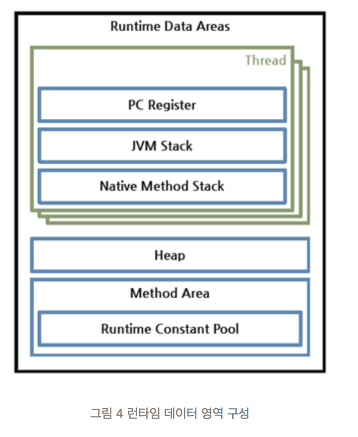

# JVM
Java Virtual Machine

네이버 D2의 내용을 JVM 에 관한 이야기 중 이해가 되는 부분만 간략하게 요약해 봤다.

네이버 D2의 내용을 JVM 에 관한 이야기 중 이해가 되는 부분만 간략하게 요약해 봤다.

## 1. JVM 동작 원리

[출처 : http://d2.naver.com/helloworld/1230]

클래스 로더(Class Loader)가 컴파일된 자바 바이트코드를 런타임 데이터 영역(Runtime Data Areas)에 로드하고, 실행 엔진(Execution Engine)이 자바 바이트코드를 실행한다.

## 2. 런타임 데이터 영역

JVM은 OS에서 실행되면서 프로그램으로써 할당받는 메모리 영역을 런타임 데이터 영역이라고 합니다.

[출처 : http://d2.naver.com/helloworld/1230]

위의 그림에서 Thread 가 표시된 부분 (PC Register, JVM Stack, Native Method Stack) 영역은 스레드 마다 생성이 됩니다.

힙, MethodArea, RuntimeConstantPool 이 부분은 모든 스레드가 공유해서 사용합니다. 

### 1. 스레드 마다 생성

### 1-1) PC Register
PC 레지스터는 각 스레드 마다 존재하며, 스레드가 시작될 때 생성된다. PC 레지스터는 현재 수행중인 JVM 명령의 주소를 가집니다.

### 1-2) JVM Stack
Last In First Out (LIFO), 메서드 호출 시마다 각각의 스택프레임이 생성,  호출된 메서드의 매개변수, 지역변수, 리턴 값 및 연산 시 일어나는 값들을 임시로저장, 메서드 수행이 끝나면 프레임별로 삭제

### 1-3) Native Method Stack
자바 외의 언어로 작성된 네이티브 코드를 위한 스택이다.

### 2. 모든 스레드 공유

### 2-1) Heap
New 연산자를 통해서 인스턴스 또는 객체를 저장하는 영역이다. 이 Heap 영역이 가비지콜렉션의 대상이 된다. 가비지 콜렉터를 통해서 메모리를 반환한다.

### 2-2) Method Area
JVM이 시작될 때 생성된다. 클래스와 인터페이스에 대한 런타임 상수 풀, 필드와 메서드 정보, Static 변수, 메서드의 바이트코드 등을 보관한다. 

### 2-3) Runtime Constant Pool
클래스 파일 포맷에서 constant_pool 테이블에 해당하는 영역이다. 메서드 영역에 포함되는 영역이긴 하지만, JVM 동작에서 가장 핵심적인 역할을 수행하는 곳이기 때문에 JVM 명세에서도 따로 중요하게 기술한다. 각 클래스와 인터페이스의 상수뿐만 아니라, 메서드와 필드에 대한 모든 레퍼런스까지 담고 있는 테이블이다. 즉, 어떤 메서드나 필드를 참조할 때 JVM은 런타임 상수 풀을 통해 해당 메서드나 필드의 실제 메모리상 주소를 찾아서 참조한다.

## 3. 가비지 콜렉션

가비지 콜렉션이 하는 내용은 간단하게 한줄로 표현하자면 '힙(heap) 내의 객체 중에서 가비지(garbage)를 찾아내고, 찾아낸 가비지를 처리해서 힙의 메모리를 회수한다.' 로 표현할 수 있다.

가비지 콜렉션은 객체가 가비지 인지 아닌지 판단 하기 위해서 'reachability'라는 개념을 사용한다. 어떤 힙영역에 할당 된 객체가 유효한 참조가 있으면 'reachability', 없다면 'unreachability' 로 판단한다. 하나의 객체는 다른 객체를 참조하고, 다른 객체는 또 다른 객체를 참조할 수 있기 떄문에 참조 사슬이 형성이 되는데 이 참조 사슬 중 최초에 참조한 것을 Root Set 이라고 칭한다.

[출처 :http://d2.naver.com/helloworld/329631]

위에서 봤던 런타임 데이터 영역에 관한 그림이다.

힙 영역에 있는 객체들은

- 힙 내의 다른 객체에 의한 참조

- Java 스택, 즉 Java 메서드 실행 시에 사용하는 지역 변수와 파라미터들에 의한 참조 (Root Set)

- 네이티브 스택, 즉 JNI(Java Native Interface)에 의해 생성된 객체에 대한 참조 (Root Set)

- 메서드 영역의 정적 변수에 의한 참조 (Root Set)

이 네가지 중 하나이고 '힙 내의 다른 객체에 의한 참조' 외에는 Root Set 이다.

[출처 :http://d2.naver.com/helloworld/329631]

Root Set과 관련된 그림이다.

Root Set으로 시작된 참조 사슬을 reachability 상태로 보고, reachability 참조 사슬이 참조하고 있지 않은 모든 객체들은 가비지콜렉션 대상인 unreachability 상태가 된다.

가비지 콜렉션이 실행 될 때는 JVM의 실행을 멈추게 되는데 그 것을 'stop-the-world'가 발생한다고 한다.

HotSpot VM에서는 물리적인 공간을 2개로 나누었는데 Old영역과 Young 영역 이다.

Young 영역 : 새롭게 생성한 객체의 대부분이 여기에 위치한다. 대부분의 객체가 금방 접근 불가능 상태가 되기 때문에 매우 많은 객체가 Young 영역에 생성되었다가 사라진다. 이 영역에서 객체가 사라질때 Minor GC가 발생한다고 말한다.

Old 영역 : 접근 불가능 상태로 되지 않아 Young 영역에서 살아남은 객체가 여기로 복사된다. 대부분 Young 영역보다 크게 할당하며, 크기가 큰 만큼 Young 영역보다 GC는 적게 발생한다. 이 영역에서 객체가 사라질 때 Major GC(혹은 Full GC)가 발생한다고 말한다.

[출처 :http://d2.naver.com/helloworld/1329]

Young 영역에서 살아남은 객체가 Old 영역으로 할당이 된다. Permanent 영역은 Old 영역에서 살아남은 객체가 영원히 남아있는 곳은 아니고, 이 부분도 GC 가 발생한다. 이 부분도 Major GC 가 일어나는 것이다.

[출처 :http://d2.naver.com/helloworld/1329]

Old 영역에서 Young 영역으로 참조가 있을 때는 Old 영역에 512byte의 chunk로 되어있는 카드 테이블이 존재하는데, Old 영역에서 Young영역으로의 객체를 참조 할 때마다 정보가 표시된다. Young 영역의 GC를 실행할 때는 Old 영역의 전체를 다 뒤져보는 것이 아니라, 카드 테이블만 뒤진다.

### 1) Young 영역

Young 영역은 Eden 영역, Survivor 영역 2개로  총 3개의 영역으로 나뉜다.

대부분 새로 생성한 객체는 Eden 영역으로 이동되고, Eden영역에서 GC가 발생하고 살아남은 객체는 Suvivor 영역으로 이동한다.

그렇게 Eden영역의 GC가 몇번 일어나게 되고 Survivor영역이 점점 차게되고 Survivor 영역이 가득차게 되면 해당 Survivor 영역을 아무 데이터도 없게 비우면서 살아남은 객체들을 다른 Survivor 영역으로 이동시킨다.

이 과정을 반복하다 살아남은 객체는 Old영역으로 넘어가게 된다.

[출처 :http://d2.naver.com/helloworld/1329]

Minor GC에관한 그림이다.

### 2) Old 영역

Old영역은 가득차게 되면 Major GC가 일어나고

Serial GC, Parallel GC, Parallel Old GC(Parallel Compacting GC), Concurrent Mark & Sweep GC(이하 CMS), G1(Garbage First) GC

이렇게 5개의 방식이 있다.

### 출처
http://d2.naver.com/helloworld/1230

http://d2.naver.com/helloworld/1329

http://d2.naver.com/helloworld/329631