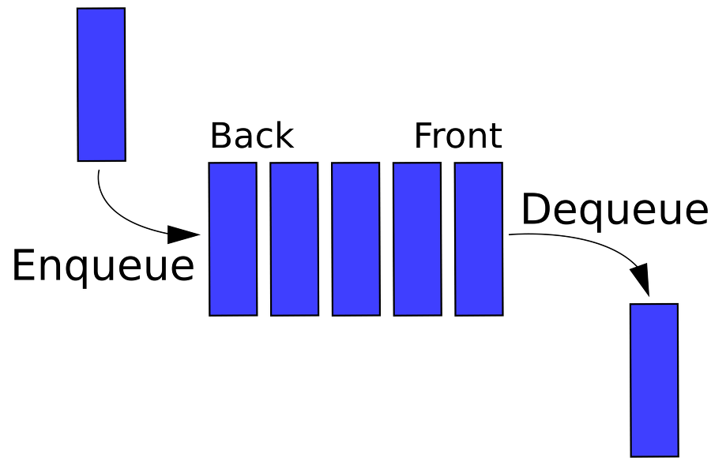

## Queue
큐는 스택과 가장 많이 비교되는 자료구조이자 기초적인 자료구조의 한가지로 나중에 넣은 데이터가 가장 늦게 나오는, 가장 먼저 넣은 데이터가 가장 빨리 나오는 자료구조이다.

스택은 한쪽 방향으로만 자료를 넣고 뺄수 있었다면, 큐는 한쪽방향으로 넣고 반대쪽 방향으로 자료를 뺄 수 있다.

말로하는 것 보다 그림으로 보면 더 이해가 쉽다.



[출처 : https://ko.wikipedia.org/wiki/큐_(자료_구조)]

자료를 넣을 때 한쪽 끝으로 Enqueue 하여 자료를 널 수 있고,

자료를 뺄 때 반대쪽 끝에서 Dequeue 하여 자료를 꺼낼 수 있다.

한쪽 끝에서 자료를 넣고, 반대쪽에서 자료를 꺼내다보니 가장 먼저 넣은 자료가 자료를 뺄 때 가장 먼저 나온다.

이 것을 FIFO - First In First Out 이라고 한다.


큐 메인 메소드는 

enqueue - 자료를 넣을 때 사용한다.

dequeue - 자료를 꺼낼 때 사용한다. (데이터를 반환까지 한다.)

enqueue, dequeue 은 반대 방향에서 이루어 진다.


### 구현
```java
public class Queue<E> {
    private Node<E> front;
    private Node<E> back;
    private int count;

    public void enqueue(E data) {
        Node<E> newNode = new Node<E>(data);
        if (front == null) {
            front = newNode;
            back = newNode;
        } else {
            back.next = newNode;
            back = newNode;
        }
        count++;
    }

    public E dequeue() {
        Node<E> temp = front;
        if (temp == null) return null;
        if (front.next == null) {
            front = null;
            back = null;
        } else {
            front = front.next;
        }
        count--;
        return temp.data;
    }

    public boolean isEmpty() {
        return (front == null);
    }

    public int getSize() {
        return count;
    }

    class Node<E> {
        E data;
        Node<E> next;
        Node(E data) {
            this.data = data;
        }
    }
}
```