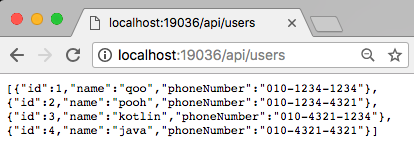
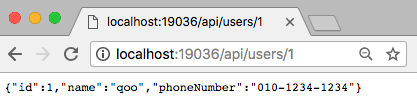

# Setup data-jpa, flyway on spring boot2 with kotlin
## 1. Setup data-jpa
### 1. build.gradle 
```
dependencies {
	...
	compile("org.springframework.boot:spring-boot-starter-data-jpa")
	compile("mysql:mysql-connector-java:5.1.46")
	...
}

``` 
### 2. entity class
```kotlin
@Entity
@Table(name = "users")
data class User(@Id @GeneratedValue(strategy = GenerationType.IDENTITY) @Column(name = "id") val id: Long,
                @Column(name = "name", nullable = false) val name: String,
                @Column(name = "phoneNumber", nullable = false) val phoneNumber: String
)
```

#### 참고사항
```
org.springframework.orm.jpa.JpaSystemException: No default constructor for entity:
```
코틀린으로 data entity를 만드는 과정에서 아무 설정도 하지 않으면 에러가 발생하게된다.

그 이유는 Entity를 만들 때 default constructor가 필요한데 코틀린은 기본값을 다 지정해야 default constructor를 이용할 수 있다.

매번 기본 값을 채우기 번거롭기 떄문에 'kotlin-noarg' 를 이용할 것이다.

##### build.gradle
```
buildscript {
	ext {
		kotlinVersion = '1.2.30'
	}
	dependencies {
		classpath("org.jetbrains.kotlin:kotlin-noarg:${kotlinVersion}")
	}
	...
}

apply plugin: "kotlin-jpa"

```
'kotlin-jpa'를 추가해주면 jpa에 필요한 noarg 옵션들을 다 추가해준다.

### 3. Repository
```kotlin
interface UserRepository : JpaRepository<User, Long>
```

### 4. Config
```kotlin
@Configuration
@EnableJpaRepositories(basePackages = ["com.qoo.spring5kotlinreactjs"])
class JpaDatabaseConfig
```

### 5. application.properties
```
## Spring DATASOURCE (DataSourceAutoConfiguration & DataSourceProperties)
spring.datasource.url=jdbc:mysql://localhost:3306/spring_kotlin_example
spring.datasource.username=root
spring.datasource.password=

## Hibernate Properties
# The SQL dialect makes Hibernate generate better SQL for the chosen database
spring.jpa.properties.hibernate.dialect=org.hibernate.dialect.MySQL5InnoDBDialect

## This is important
# Hibernate ddl auto (create, create-drop, validate, update)
spring.jpa.hibernate.ddl-auto=validate
spring.jpa.hibernate.naming.physical-strategy=org.hibernate.boot.model.naming.PhysicalNamingStrategyStandardImpl
spring.jpa.hibernate.naming.implicit-strategy=org.hibernate.boot.model.naming.ImplicitNamingStrategyLegacyJpaImpl

```

### 6. test
#### 1. make handler
```kotlin
@Service
class UserApiHandler(val userRepository: UserRepository) {

    fun handleGetUserList(request: ServerRequest): Mono<ServerResponse> =
            ok().json()
                    .body(Flux.fromIterable(userRepository.findAll()), User::class.java)

    fun handleGetById(request: ServerRequest): Mono<ServerResponse> =
            ok().json()
                    .body(Mono.justOrEmpty(userRepository.findById(request.pathVariable("id").toLong())), User::class.java)
}

```

### 2. make router config
```kotlin
@Configuration
class AppRoutes {

    @Bean
    fun apiRouter(userApiHandler: UserApiHandler) = router {
        (accept(MediaType.APPLICATION_JSON_UTF8) and "/api").nest {
            GET("/users", userApiHandler::handleGetUserList)
            GET("/users/{id}", userApiHandler::handleGetById)
        }
    }
}
```

### 3. results
#### 1. list api

#### 1. get one api


## 2. Setup flyway
### 1. build.gradle
```
dependencies {
	...
	compile("org.flywaydb:flyway-core:5.0.7")
	...
}

```
### 2. application.properties
```
spring.flyway.url=jdbc:mysql://localhost:3306/spring_kotlin_example
spring.flyway.enabled=true
spring.flyway.encoding=UTF-8
spring.flyway.user=root
spring.flyway.password=
spring.flyway.baseline-on-migrate=true
```

### 3. add sql files
#### V1__init_tables.sql
```
CREATE TABLE `spring_kotlin_example`.`users` (
  `id` BIGINT(20) NOT NULL AUTO_INCREMENT,
  `name` VARCHAR(100) NOT NULL,
  `phoneNumber` VARCHAR(100) NOT NULL,
  PRIMARY KEY (`id`));

INSERT INTO `spring_kotlin_example`.`users` (`name`, `phoneNumber`) VALUES ('qoo', '010-1234-1234');
```
#### V2__insert_dummy_data.sql
```
SELECT @UserId := max(id) FROM `spring_kotlin_example`.`users`;

INSERT INTO `spring_kotlin_example`.`users` (`id`, `name`, `phoneNumber`) VALUES ((@UserId := @UserId + 1), 'pooh', '010-1234-4321');
INSERT INTO `spring_kotlin_example`.`users` (`id`, `name`, `phoneNumber`) VALUES ((@UserId := @UserId + 1), 'kotlin', '010-4321-1234');
INSERT INTO `spring_kotlin_example`.`users` (`id`, `name`, `phoneNumber`) VALUES ((@UserId := @UserId + 1), 'java', '010-4321-4321');
```

이 파일들은 resources/db.migration 에 넣어줘야한다.
그 후 bootRun 을하게되면 자동으로 서버를 구동하기 전에 flyway가 작동한다. 