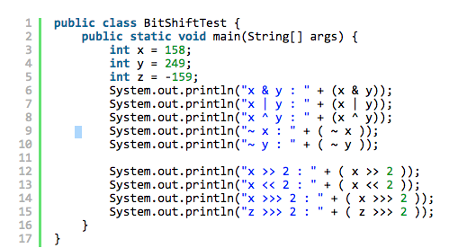
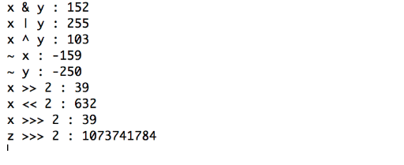

# 비트연산자
비트 연산자는 컴퓨터 내부의 정보를 비트 단위로 비교하거나 조작할 때 사용합니다.

## 1) AND ( & )
각 비트를 비교하여 양쪽모두 1이면 1, 아니면 0을 반환

x = 158, y = 249 이라면

x, y 를 이진수로 변환하면

x = 1 0 0 1 1 1 1 0

y = 1 1 1 1 1 0 0 1

x &  y = 1 0 0 1 1 0 0 0 = 152 가 된다.

## 2) OR ( | )

각 비트를 비교하여 어느 한쪽이라도 1이면 1, 어느한쪽도 1이 없다면 0을 반환

x = 158, y = 249 이라면

x, y 를 이진수로 변환하면

x = 1 0 0 1 1 1 1 0

y = 1 1 1 1 1 0 0 1

x |  y = 1 1 1 1 1 1 1 1 = 255 가 된다.

## 3) XOR ( ^ )

각 비트를 비교하여 비트가 같다면 0, 다르다면 1을 반환

x = 158, y = 249 이라면

x, y 를 이진수로 변환하면

x = 1 0 0 1 1 1 1 0

y = 1 1 1 1 1 0 0 1

x ^ y = 0 1 1 0 0 1 1 1 = 103 가 된다.

## 4) NOT( ~ )

각 비트를 반전시킨 값을 반환

x = 158 이라면

x 를 이진수로 변환하면

x = 0 0 0 0     0 0 0 0     1 0 0 1      1 1 1 0

~ x = 1 1 1 1      1 1 1 1      0 1 1 0     0 0 0 1 (부호가 있는 2의 보수) = -159 가 된다.

# 시프트 연산자

비트 열을 좌우로 지시한 만큼 이동한다.

## 1) Right Shift ( \>\> )

오른쪽으로 특정 비트 수만큼 이동시키고 빈자리는 양수 일때는 0, 음수 일때는 1로 채운다.

x = 158 이라면

x 를 이진수로 변환하면

0 0 0 0     0 0 0 0     0 0 0 0     0 0 0 0     0 0 0 0     0 0 0 0     1 0 0 1      1 1 1 0

x \>\> 2

0 0 0 0     0 0 0 0     0 0 0 0     0 0 0 0     0 0 0 0     0 0 0 0     0 0 1 0     0 1 1 1 = 39

## 2) Left Shift ( \<\< )

왼쪽으로 특정 비트 수 만큼 이동시키고 빈자리는 0으로 채운다.

x = 158 이라면

x 를 이진수로 변환하면

0 0 0 0     0 0 0 0     0 0 0 0     0 0 0 0     0 0 0 0     0 0 0 0     1 0 0 1      1 1 1 0

x \<\< 2

0 0 0 0     0 0 0 0     0 0 0 0     0 0 0 0     0 0 0 0     0 0 1 0     0 1 1 1     1 0 0 0 = 632

## 3) Unsigned Right Shift ( \>\>\> ) (* cf. '\<\<\<'은 없다, 그러고 '\>\>\>'은 Java에만 있다.)

원리는 \>\> 과 같다. 그러나 무조건 앞쪽의 비트를 0으로 채운다. 이 연산을 하면 무조건 unsigned가 된다.

양수 일때는 차이가 없고, 음수일 때는 차이가 있다.

양수 ) 

x = 158 이라면

x 를 이진수로 변환하면

0 0 0 0     0 0 0 0     0 0 0 0     0 0 0 0     0 0 0 0     0 0 0 0     1 0 0 1      1 1 1 0

x \>\>\> 2

0 0 0 0     0 0 0 0     0 0 0 0     0 0 0 0     0 0 0 0     0 0 0 0     0 0 1 0     0 1 1 1 = 39

역시 차이가 없다.

음수 ) 

x = -159 라면

x를 이진수로 변환하면

1 1 1 1     1 1 1 1     1 1 1 1     1 1 1 1      1 1 1 1      1 1 1 1      0 1 1 0     0 0 0 1

x \>\>\> 2

0 0 1 1     1 1 1 1     1 1 1 1     1 1 1 1     1 1 1 1     1 1 1 1     1 1 0 1     1 0 0 0  = 1073741784

음수일 때만 고려하면 된다.

기본적인 연산인 만큼 각자 테스트를 통해서 정확하게 알고가면 좋을 것 같다.

코드 ) 

결과 ) 
