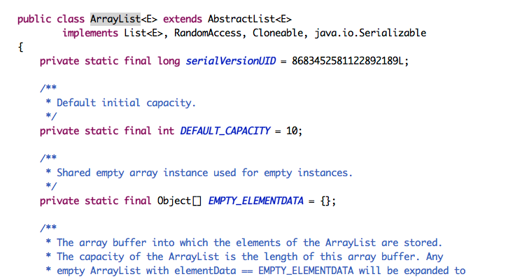
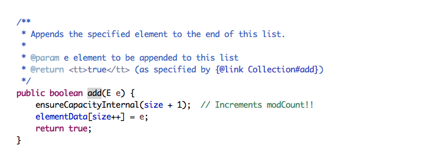
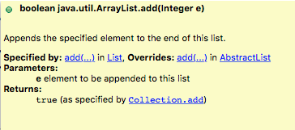
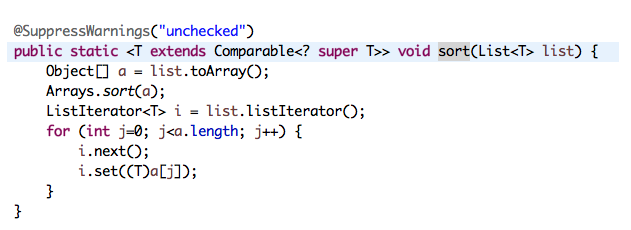
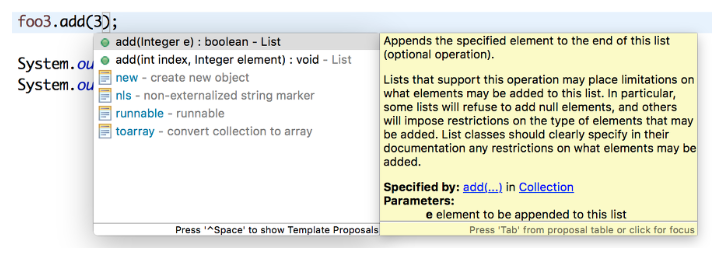
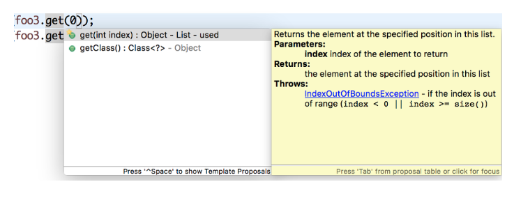

# Generic
제네릭이란 클래스에서 사용할 내부 데이터 타입을 외부에서 지정해주는 방법이다.

조금 개념이 어려울 수도 있지만 우리는 제네릭 개념을 알기도 전에 자바 프로그래밍하면서 제네릭을 사용했을 것이다.

ArrayList<Integer> array = new ArrayList<Integer>();

이 코드의 의미는
ArrayList 클래스의 내부 타입을 Integer 로 지정해서 객체를 생성하겠다.

## ArrayList 코드의 일부이다. 

위에서 <E>를 <Integer>로 지정했기 때문에 객체로 생성할 때 E 는 Integer로 지정이 될 것이다.
 


또한 E 는 Integer로 지정이 되었으니 



이런 메소드, 변수 등 모두 E는 Integer로 지정이 될 것이다.

실제로 이 코드를 작성해보고 마우스 오버를 하니 Integer로 지정이 되어서 설명이 나오는 것을 알 수 있다.

array.add(1);



## 그렇다면 제네릭을 왜 사용하는가?

한 번 더 생각을 해보면 만약 ArrayList에 제네릭이 없다고 하면 분명 Object로 구현을 했을 것이다.

실제로 자바 1.5버전 미만에서는 그렇게 구현을 했다고 한다.

그렇다면 add는 상관없겠지만 get을 했다고 생각하면 무조건 자신이 사용하려고 하는 객체로 타입 캐스팅을 해야 하지 않겠는가?

타입 캐스팅을 하는 과정에서 java.lang.ClassCastException 이 일어날 수 있다. 

이것을 타입에 안전하지 않기 때문이라고 하는데, 이 부분을 제네릭을 사용한다면 발생할 일이 거의 없다. 

그렇기 때문에 타입에 안전하기 위해서 사용한다고 하는 것이 가장 좋은 답이라 생각한다.


## 제네릭은 그렇다면 모든 클래스를 다 받아들이는가?

자바를 프로그래밍 하면서 

Collections.sort(array);

이 메소드를 사용해 봤을 것으로 생각한다.

앞의 'Comparable, Comparator Interface 정렬 http://pooh-explorer.tistory.com/6 포스팅'에서 comparable 객체를 설명했을 것이다.

만약 Collections.sort에 들어오는 List의 Element가 

```java
public class Pooh {

	private String companyName;

	public String getCompanyName() {
		return companyName;
	}

	public void setCompanyName(String companyName) {
		this.companyName = companyName;
	}
}
```
이런 객체라고 한다면 어떻게  Collections.sort 가 동작할 수 있을까? 

답부터 말하자면 동작할 수 없다. 왜냐하면 Collections.sort는 들어오는 List의 Element가 comparable 객체를 상속 받고 있다고 가정하고 구현했기 때문이다.

그렇다면 comparable 객체를 상속받아야지만 가능하도록 제한해야만 한다.


제네릭에서는 와일드카드를 이용해 제한할 수 있다.

그렇다면 Collections.sort 코드를 보자.





```java
<T extends Comparable>
```

T는 Comparable 을 포함한 Comparable을 상속받은 하위 객체를 나타내고, Comparable 객체로 인식한다.

그렇기 때문에 Comparable의 하위 객체가 아니라면 오류가 발생할 것이다.

이 와일드카드는 어렵지 않게 이해할 수 있을 것이다.


```java
Comparable<? super T>
```
<?>은 모든 객체 라는 와일드카드이고, 이 말은 T를 포함한 T의 모든 상위 객체를 나타내고, Object로 인식한다.

말이 너무 어렵지만 말 그대로 이해하면 된다. 

어떤 경우에 사용하는 것인지 조금 쉬운 다른 예로 이해해 보겠다. 


```java
ArrayList<Object> objectArray = new ArrayList<Object>();
objectArray.add(new String("hello"));
List<? super Integer> foo = objectArray;
foo.add(3);
System.out.println(foo.get(0));
System.out.println(foo.get(1));
```
결과)
```
hello
3
```

유연성을 위한 것으로 읽는 것과 쓰는것으로 나누어 보자.

foo가 처음 참조할 때 List<Integer> 이면 ArrayList<Object>를 참조하지 못할 것이다.

하지만 List<? super Integer> 는 Integer 보다 상위 클래스의 원소를 가지는 의 List 라면 참조 하겠다는 것이다.

그렇기 때문에 ArrayList<Object>를 foo가 참조할 수 있는 것이다.

결론적으로 foo는 위에서 'Object로 인식한다' 라는 말을 했듯이 List<Object>를 참조하는 것이다.

하지만 참조한 후에는 읽는 것은 T 객체를 보장하지 않는다, 하지만 쓰는것은 T 로 제한된다.



add 할 때 화면이다. Integer로 제한한 것을 볼 수 있다.


get 할 때 화면이다. Object로 반환하는 것을 볼 수 있다.


## 제네릭의 알파벳? 
지금까지 제네릭을 알아보면서 여기서 알파벳은 어떤 것은 E이고, 어떤 것은 T 이고 궁금하지 않았는가? 

HashMap <K,V> 를 본적이 있는가? 여기는 왜 K, V 인가?

한번 제네릭의 파라미터에 대해서 알아보자!

E - Element (자바의 Collection과 같은 List형태의 객체에서 원소의 객체 타입을 나타낼 때 많이 사용한다)

T - Type (일반적으로 많이 사용되며, 객체 내부의 타입의 지정할 때 사용한다.)

K - Key

V - Value

N - Number

S,U,V (추가적인 파라미터)

사실 어떤 파라미터를 사용해도 기능상 차이는 없다.

다만 가독성이 높아져서 코드를 이해하는데 많은 도움을 줄 수 있다.